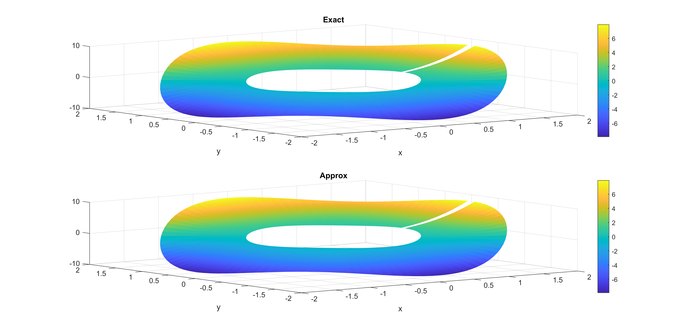
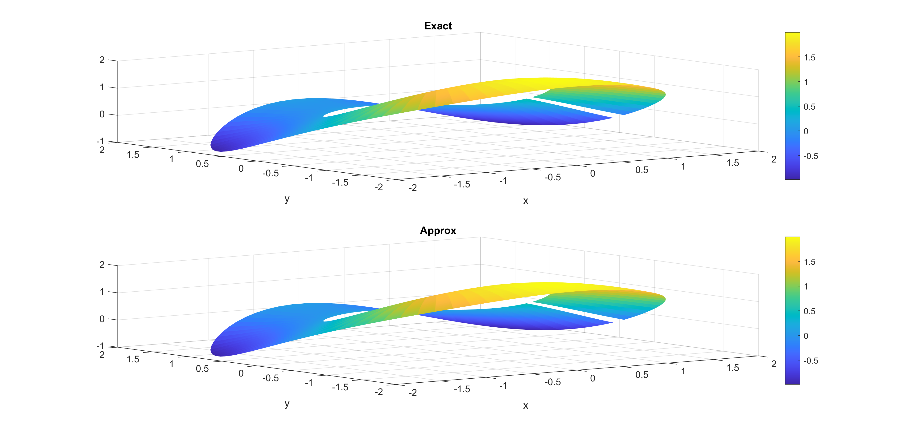
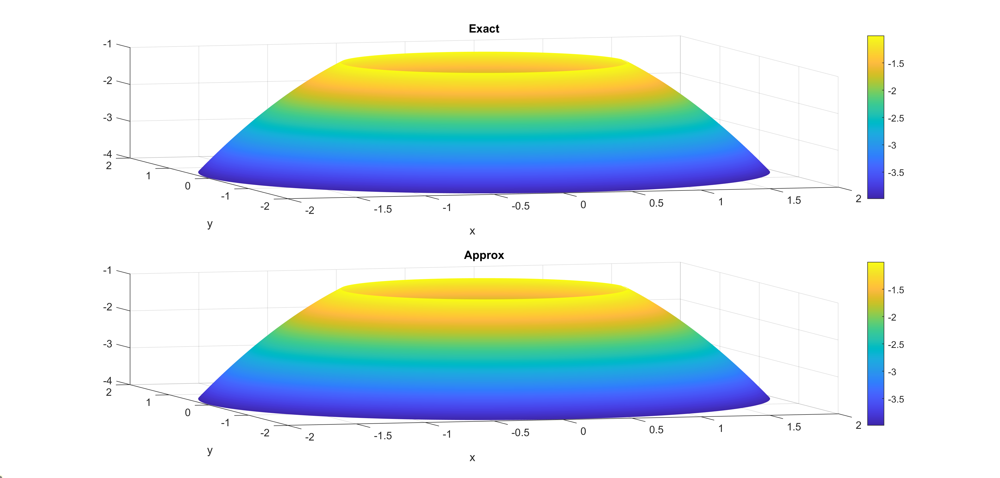
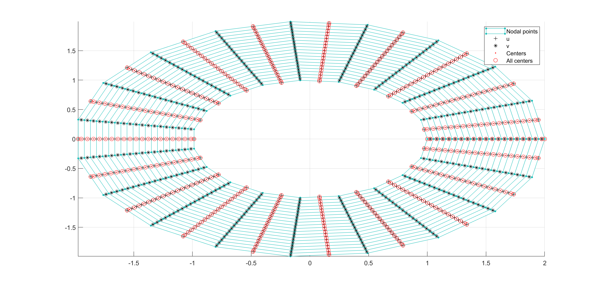
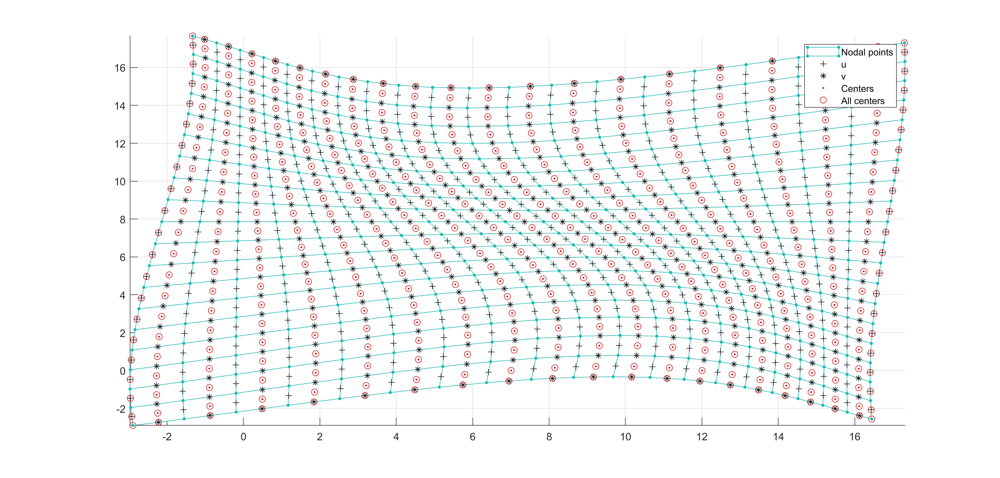
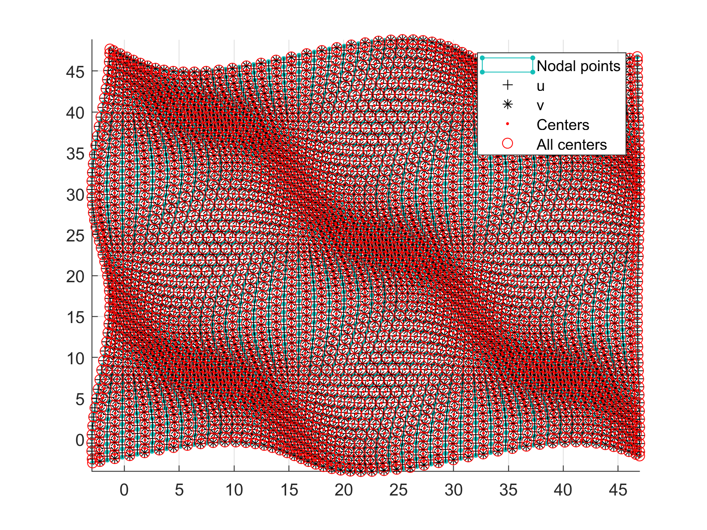
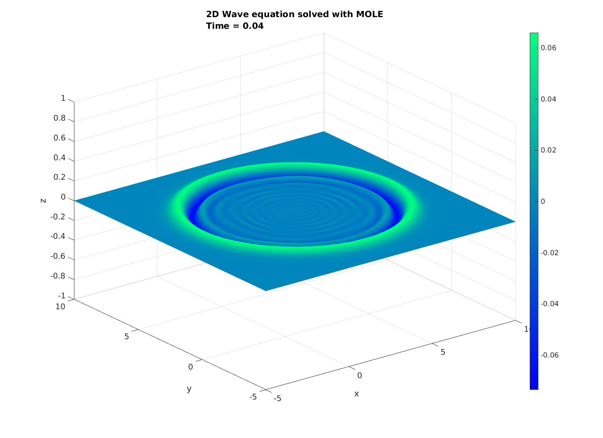
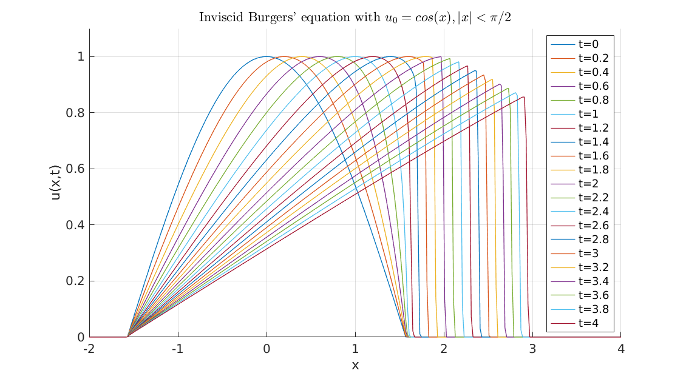

# MOLE: Mimetic Operators Library Enhanced

## Description

MOLE is a high-quality (C++ & MATLAB/Octave) library that implements 
high-order mimetic operators to solve partial differential equations. 
It provides discrete analogs of the most common vector calculus operators: 
Gradient, Divergence, Laplacian, Bilaplacian, and Curl. These operators (highly sparse matrices) act 
on staggered grids (uniform, non-uniform, curvilinear) and satisfy local and 
global conservation laws.

Mathematics is based on the work of [Corbino and Castillo, 2020](https://doi.org/10.1016/j.cam.2019.06.042). 
However, the user may find helpful previous publications, such as [Castillo and Grone, 2003](https://doi.org/10.1137/S0895479801398025),
in which similar operators were derived using a matrix analysis approach.


## Licensing

MOLE is distributed under a GNU General Public License; please refer to the _LICENSE_ 
file for more details.


## Installation

### Prerequisites

To install the MOLE library, you'll need the following packages:

- CMake (Minimum version 3.10)
- OpenBLAS (Minimum version 0.3.10)
- Eigen3
- LAPACK (Mac only)
- libomp (Mac only)

### Package Installation by OS

#### Ubuntu/Debian Systems

```bash
# Install all required packages
sudo apt install cmake libopenblas-dev libeigen3-dev
```

#### macOS Systems

Install [Homebrew](https://brew.sh/) if you don't have it already, then run:

```bash
# Install all required packages
brew install cmake openblas eigen libomp lapack
```

> **Troubleshooting Homebrew:** If you encounter installation errors, try these steps:
> ```bash
> # Fix permissions issues
> sudo chown -R $(whoami) /usr/local/Cellar
> # Fix shallow clone issues
> git -C /usr/local/Homebrew/Library/Taps/homebrew/homebrew-core fetch --unshallow
> # Remove Java dependencies if they cause conflicts
> brew uninstall --ignore-dependencies java
> brew update
> ```

#### RHEL/CentOS/Fedora Systems

```bash
# Install all required packages
sudo yum install cmake openblas-devel eigen3-devel
```

### Building and Installing MOLE

1. Clone the repository:
   ```bash
   git clone https://github.com/csrc-sdsu/mole.git  
   cd mole  
   ```

2. Build the library:
   ```bash
   mkdir build && cd build  
   cmake ..
   make
   ```

3. Install the library:
   - For a custom location:
     ```bash
     cmake --install . --prefix /path/to/location
     ```
   - For a system location (requires privileges):
     ```bash
     sudo cmake --install .
     ```
     Or
     ```bash
     sudo cmake --install . --prefix /path/to/privileged/location
     ```

**Note:** Armadillo and SuperLU will be automatically installed in the build directory during the build process.


## Examples and Tests

MOLE includes comprehensive examples and tests for both C++ and MATLAB/Octave implementations.

### Available Resources

| Directory | Description | How to Run |
|-----------|-------------|------------|
| **tests/cpp** | Four tests that verify the correct installation of MOLE and its dependencies | Run `make run_tests` in the build directory |
| **tests/matlab** | MATLAB/Octave equivalents of the C++ tests | Navigate to `tests/matlab` and execute `run_tests.m` |
| **examples/cpp** | Self-contained examples solving typical PDEs | Find compiled examples in `build/examples/cpp` after running `make` |
| **examples/matlab** | Over 30 examples from linear one-dimensional PDEs to nonlinear multidimensional PDEs | Open desired script in `examples/matlab` and run it in MATLAB/Octave |

We recommend running the tests before starting to use the library to ensure everything is working correctly.

## Documentation

For detailed documentation, including API references, tutorials, and examples, please refer to our [Documentation Guide](https://csrc-sdsu.github.io/mole/build/html/).

> **Important Note:** Performing non-unary operations involving operands constructed over different grids may lead to unexpected results. While MOLE allows such operations without throwing errors, users must exercise caution when manipulating operators across different grids.

## Community Guidelines

We welcome contributions to MOLE, including:
- Adding new functionalities
- Providing examples
- Addressing existing issues
- Reporting bugs
- Requesting new features

Please refer to our [Contribution Guidelines](https://github.com/csrc-sdsu/mole/blob/master/CONTRIBUTING.md) for more details.


## Citations

Please cite our work if you use MOLE in your research or software. 
Citations are helpful for the continued development and maintenance of 
the library [](https://doi.org/10.21105/joss.06288)

[](https://www.mathworks.com/matlabcentral/fileexchange/124870-mole)

## Gallery

Now, some cool pictures obtained with MOLE:








