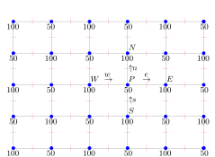

# Why Staggered Grids?

> **Authors:** Johnny Corbino, Miguel A. Dumett  
> **Abstract:** This document justifies the usage of staggered grids in mimetic
> differences.

---

## Introduction

The general purpose for using staggered grids is to differentiate
between (physical) quantities that utilize exterior and interior
boundary orientations. Naturally, this splitting triggers the usage of a
primal and a dual grids. Nevertheless, the current implementation of
MOLE does not considers orientations, therefore in what follows an
argument in favor of using staggered grids is given.

## Justification

Mimetic difference operators are constructed for staggered grids
[[1](#ref1)].

This allows:

-   More accurate solutions.

-   Expected physical behavior (overcomes checkerboard pressure fields).

## Checkerboard pressure fields

Suppose a two-dimensional incompressible flow without a body force. The
governing equations are: 

$$
\begin{aligned}
\frac{\partial u}{\partial x} + \frac{\partial v}{\partial y} &= 0 \\
\rho \, u \, \frac{\partial u}{\partial x} + \rho \, v \, \frac{\partial u}{\partial y} &= \frac{\partial}{\partial x} \left( \mu \, \frac{\partial u}{\partial x} \right) + \frac{\partial}{\partial y} \left( \mu \, \frac{\partial u}{\partial y} \right) - \frac{\partial p}{\partial x} \\
\rho \, u \, \frac{\partial v}{\partial x} + \rho \, v \, \frac{\partial v}{\partial y} &= \frac{\partial}{\partial x} \left( \mu \, \frac{\partial v}{\partial x} \right) + \frac{\partial}{\partial y} \left( \mu \, \frac{\partial v}{\partial y} \right) - \frac{\partial p}{\partial y}
\end{aligned}
$$

Equations (1)-(3) are the continuity equation, and the momentum equations in the $x$- and $y$-direction, respectively.

The checkerboard pressure field is shown in Figure 1.

*Checkerboard pressure field showing the pressure oscillations*

The figure represents a checkerboard pressure field.

The source term for the momentum equations in the $x$- and $y$-direction
can be expressed as

$$
S_u = - \frac{\partial p}{\partial x} \quad \text{and} \quad S_v = - \frac{\partial p}{\partial y}
$$

respectively. If central difference is employed, the pressure gradient
becomes,

$$
\left( \frac{\partial p}{\partial x} \right)_P = \frac{p_E - p_W}{\Delta x} = \frac{\frac{p_E + p_P}{2} - \frac{p_P + p_W}{2}}{\Delta x} = \frac{p_E - p_W}{2 \, \Delta x}
$$

and similarly,

$$
\left( \frac{\partial p}{\partial y} \right)_P = \frac{p_N - p_S}{2 \, \Delta y}
$$

From equations (4)-(5), we can see that **the pressure gradient at point $P$ is related to the pressures of the neighbor grid points and not to its own pressure**. Therefore, if we have a pressure distribution as shown in the figure above, the discretization scheme represented by equations (4)-(5) will obtain $\frac{\partial p}{\partial x} = 0$ and $\frac{\partial p}{\partial y} = 0$ throughout the computational domain. This means that **it will not recognize the difference between a checkerboard pressure field and a uniform pressure field**. This behavior is obviously non-physical.

## Staggered grids

A remedy for the aforementioned problem is to use staggered grids. The
idea is to store scalar variables at the ordinary nodal points, and
vector variables at the cell faces in between the nodal points.

The staggered grid arrangement is shown in Figure 2.

*Staggered grid arrangement showing the location of different variables*

The figure shows the new arrangement.

If we consider the checkerboard pressure field again, substitution of
the appropriate nodal pressure values into equations
(4)-(5) now yields very significant non-zero pressure
gradient terms. The staggering of the velocity avoids the unrealistic
behavior for spatially oscillating pressure fields. In addition, this
new arrangement does not require interpolation to calculate velocities
at the cell faces (where they are needed for the scalar
transport-convection-diffusion computations.

## References

1. J. Corbino, and J.E. Castillo, "High-order mimetic finite-difference operators satisfying the extended Gauss divergence theorem," J. Comput. Appl. Math., vol. 364, 2020, 112326.
