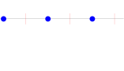
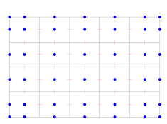

# CSRC Report on MOLE Library

## Introduction

Physical phenomena are typically modeled as a set of differential
equations subject to conservation laws. Numerical methods used to solve
these equations are of vital importance in the paradigm of computational
science. In this document, we talk about MOLE, an open-source library
that implements mimetic discretization methods (MDM) to intuitively
solve partial differential equations (PDE).

Mimetic operators are derived by constructing discrete analogs of the
continuum differential operators $\nabla, \nabla \cdot, \nabla \times$,
and $\nabla^2$. Since most continuum models are described in terms of
these operators, the MDM approach has recently gained space in the
context of numerical PDEs.

Qualities of a mimetic operator:

-   It is a discrete analog of the continuum operator

-   It satisfies identities from vector calculus

-   It satisfies global and local conservation laws

-   It provides uniform order of accuracy

-   It is easy to use (and reusable)

In 2003, Castillo and Grone came up with a matrix analysis approach to
construct high-order approximations of divergence and gradient operators [[5]](#ref5). However, in their approach, the $4^{th}$-order operators have
three free-parameters. The mimetic operators implemented in MOLE are
based on the work of [[6]](#ref6) which are a substantial improvement of
the operators introduced in [[5]](#ref5). These new operators have no
free-parameters, have optimal bandwidth, are more accurate, and in the
worst case they deliver the same accuracy as the ones from 2003.

There are many applications of MDM solving continuum problems, including
in the geosciences (porous media) [[1](#ref1), [11](#ref11)]; fluid dynamics
(Navier-Stokes) [[2](#ref2), [3](#ref3)]; image processing [[9](#ref9)]; general relativity
[[8](#ref8)]; and electromagnetism [[10](#ref10)].

## On the Mathematics

MDM not only provide uniform order of accuracy (all the way to the
boundary), but they also satisfy fundamental identities from vector
calculus,

-   Gradient of a constant 
   $G \, f = 0$

-   Free stream preservation 
    $D \, v = 0$

-   Curl of the gradient 
    $C \, G \, f = 0$

-   Divergence of the curl 
    $D \, C \, v = 0$

-   Divergence of the gradient 
    $D \, G \, f = L \, f$

In addition, the discrete version of the extended Gauss' divergence
theorem is also satisfied with high-order accuracy:

```{math}
    \langle D \, v, f \rangle_Q + \langle v, G \, f \rangle_P = \langle B \, v, f \rangle --- (1)
```

The deduction of equation (1) can be found in [[4]](#ref4).

When using MDM we are not discretizing the equations (as it is done with
standard finite-difference methods (FDM)), but instead we construct a
discrete analog to the differential operator, 

$$\begin{array}{ccc}
\frac{\partial^2 f}{\partial x^2} & & \frac{\partial^2}{\partial x^2} f \\
& & \\
\downarrow & vs & \downarrow \\
& & \\
\frac{f_{j+1} - 2 f_j + f_{j-1}}{\Delta \, x^2} & & D \, G \, f
\end{array}$$

# Staggered Grids

Mimetic operators are defined over staggered grids.

In 1D:

<div style="text-align: center">



*Staggered grid representation in 1D showing scalar and vector field locations*
</div>

Scalar fields live in blue circles and vector fields in vertical red
segments.

In 2D:

<div style="text-align: center">



*Staggered grid representation in 2D showing scalar and vector field component locations*
</div>

Scalar fields are defined at blue circles, and horizontal and vertical
vector field components are defined at horizontal and vertical red
segments, respectively.

In 3D:

The continuum domain is a parallelepiped. Scalar fields are defined at
cell centers and at the cell middle edges that are part of the edges of
the parallelepiped. Vector fields for the horizontal, vertical, and in
depth vector field components are defined at the cell face centers that
are perpendicular to the horizontal, vertical and in depth directions,
respectively.

There are several ways to generate uniform structured staggered grids
(in MATLAB/Octave). What is important is to remember that we need to
store the coordinates for two different quantities.

Suppose

$$
\text{west} = 0; \quad \text{east} = 1; \quad m = 10; \quad dx = (\text{east} - \text{west})/m;
$$

$$
\text{xgridSca} = [\text{west} \quad \text{west}+dx/2 : dx : \text{east} - dx/2 \quad \text{east}];
$$

This grid holds the coordinates of all scalar quantities (cell center +
boundaries). Vector quantities are just:

$$
\text{xgridVec} = \text{west} : dx : \text{east};
$$

The previous commands create a couple of one-dimensional arrays with the
coordinates of each field (scalar and vectorial). Now, we need a couple
of arrays to hold the actual values of these fields.

**NOTE:** Depending on the problem, you may need or not to explicitly
create such arrays. It is often a good practice to preallocate the
memory for better performance:

$$
\text{scalarField} = \text{zeros(numel(xgridSca)}, 1);
$$

and

$$
\text{vectorField} = \text{zeros(numel(xgridVec)}, 1);
$$

## Using the Operators

Inside the \"**examples/matlab**\" folder you will find several
MATLAB/Octave scripts that use MOLE to solve well known partial
differential equations.

Our selection includes steady-state and time-dependent problems:

-   Burger's equation

-   Richards' equation (highly nonlinear, mixed form)

-   Wave equation (with symplectic schemes)

-   Heat equation (explicitly and implicitly)

-   Etc.

Each script in the \"**examples/matlab**\" folder is adequately
commented.

You may notice that all programs have the same taxonomy:

1.  Definition of variables and initialization (initial and boundary
    conditions). Grid generation and obtainment of Mimetic Operators.

2.  Apply operators. Solve system of equations (if applicable). Time
    integration (if applicable). Update fields.

3.  Plot or process results. Check for conservation of energy, mass,
    etc. (optional).

## References

<a name="ref1"></a>
1. Aarnes, J., Krogstad, S., and Lie, K-A, Multiscale mixed/mimetic methods on corner-point grids. Computational Geoscience. 2008.

<a name="ref2"></a>
2. Abba, A., and Bonaventura, L., A mimetic finite-difference method for large eddy simulation of incompressible flow. Technical Report. Politecnico di Milano, Milano, Italy, August 2010.

<a name="ref3"></a>
3. Barbosa, E., and Daube, O., A finite-difference method for 3D incompressible flows in cylindrical coordinates. Computational Fluids. 2005.

<a name="ref4"></a>
4. Castillo, J.E., and Miranda, G.F., Mimetic Discretization Methods, CRC Press, Boca Raton, Florida, USA, 2013.

<a name="ref5"></a>
5. Castillo, J.E., and Grone, R.D., A matrix analysis approach to higher-order approximations for divergence and gradients satisfying a global conservative law, SIAM J. Matrix Anal. Appl., Vol. 25, No. 1, pp. 128-142, 2003.

<a name="ref6"></a>
6. Corbino, J., and Castillo, J.E., High-order mimetic difference operators satisfying the extended Gauss divergence theorem, Journal of Computational and Applied Mathematics, 364 (2020).

<a name="ref7"></a>
7. Corbino, J., Dumett, M.A, and Castillo, J.E., MOLE: Mimetic Operators Library Enhanced: The Open-Source Library for Solving Partial Differential Equations using Mimetic Methods, 2024. JOSS.

<a name="ref8"></a>
8. Di Bartolo, C., Gambini, R., and Pullin, J., Consistent and mimetic discretizations in general relativity. Journal of mathematical physics. 2005.

<a name="ref9"></a>
9. Haber, E., and Modersitzki, J., A multilevel method for image registration. SIAM journal on scientific computing. 2006.

<a name="ref10"></a>
10. Hyman, J.M., and Shashkov, M., Mimetic discretizations for Maxwell's equations and equations of magnetic diffusion. Fourth International Conference on Mathematical and Numerical Aspects of Wave Propagation, Golden, Colorado. SIAM. 1998.

<a name="ref11"></a>
11. Hyman, J.M., Morel, J., Shashkov, M., and Steinberg, S., Mimetic finite-difference methods for diffusion equations. Computational Geoscience. 2002.
