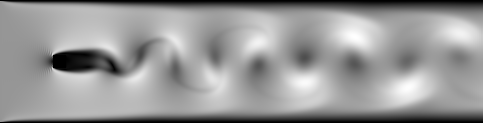

# 2D Channel Flow with a Cylinder

This example simulates a 2D incompressible channel flow past a cylinder-like obstacle (implemented as a masked no-slip region) using MOLE mimetic operators and a fractional-step (projection / pressure-correction) method. At moderate Reynolds number, the solution exhibits a wake and may show vortex shedding depending on grid resolution and time step.

## Governing Equations

We solve the incompressible Navier–Stokes equations in two dimensions:

$$
\frac{\partial \mathbf{u}}{\partial t} + (\mathbf{u}\cdot\nabla)\mathbf{u}
= -\frac{1}{\rho}\nabla p + \nu\nabla^{2}\mathbf{u}
$$

$$
\nabla\cdot\mathbf{u} = 0
$$

where:
- $$\mathbf{u}=(u,v)$$ is the velocity field
- $$p$$ is the kinematic pressure
- $$\rho$$ is the density
- $$\nu$$ is the kinematic viscosity

## Domain and Initial/Boundary Conditions

### Spatial/Temporal Domain

The computational domain is a 2D channel:

- $$x \in [0,8]$$
- $$y \in [-1,1]$$
- $$t \in [0, t_{\text{final}}]$$ with $$t_{\text{final}} = \texttt{tspan}$$ (default in code: `tspan = 32.0`)

A “cylinder” is represented by a masked block of cells located near

$$
x/L_x = \mathtt{cylin}\_\mathtt{pos}
$$

with a size controlled by `cylin_size` (default `1/10`). Inside this mask, velocity is forced to zero (no-slip).

### Initial Conditions (time-dependent)

At $$t=0$$:
- $$u(x,y,0)=U_0$$ everywhere in the fluid region
- $$v(x,y,0)=0$$
- the obstacle mask region is set to $$u=v=0$$

(Default in code: `U_init = 1.0`.)

### Boundary Conditions

Velocity boundary conditions:
- **Inlet (left)**: Dirichlet inflow with $$u = U_0$$ and $$v = 0$$
- **Outlet (right)**: zero streamwise gradient (Neumann outflow) with $$\partial u/\partial x = 0$$ and $$\partial v/\partial x = 0$$
- **Top and bottom walls**: no-slip with $$u=0$$ and $$v=0$$
- **Obstacle mask**: no-slip enforced by setting $$u=v=0$$ inside the mask region after each time step

Pressure boundary conditions (pressure Poisson step):
- **Outlet (right)**: Dirichlet reference pressure with $$p = 0$$
- **Other boundaries**: homogeneous Neumann with $$\partial p/\partial n = 0$$


## Implementation Details

### Projection (Fractional-Step) Method

Each time step advances the momentum equation and enforces incompressibility:

1. **Advection evaluation**
   - Nonlinear convection is advanced with AB2 (Adams–Bashforth 2) with AB1 used on the first step

2. **Diffusion (Helmholtz solve)**
   - Viscous diffusion is treated with Crank–Nicolson, resulting in two Helmholtz-type sparse linear systems for intermediate velocities $$u^*$$ and $$v^*$$

3. **Pressure Poisson solve**
   - Pressure is obtained from the Poisson equation derived from $$\nabla\cdot\mathbf{u}^{n+1}=0$$

$$
\nabla^2 p^{n+1} = \frac{\rho}{\Delta t}\nabla\cdot \mathbf{u}^*
$$

4. **Velocity correction**

$$
\mathbf{u}^{n+1} = \mathbf{u}^* - \frac{\Delta t}{\rho}\nabla p^{n+1}
$$

5. **Re-apply boundary conditions + obstacle mask**
   - The solver re-enforces all velocity BCs and sets the masked region to $$u=v=0$$

### Mimetic Spatial Operators (MOLE)

The spatial discretization uses MOLE operators:
- Divergence operator $$D$$
- Gradient operator $$G$$
- Laplacian operator $$L = DG$$

along with interpolation operators to map between cell-centered and face-based quantities used in flux evaluations and in the projection step.

### Output Products

The example writes:
- `U_final.csv`, `V_final.csv`, `p_final.csv` (cell-centered fields)
- an image of the final speed field named `cylinder_flow_2D_output1.png`

## Running the Example

From the build directory:

```bash
cmake --build . -j
./examples/cpp/cylinder_flow_2D
```

## Results

The final speed magnitude typically shows an acceleration around the obstacle and a wake downstream. At $$\mathrm{Re}=200$$, unsteady vortex shedding can appear depending on grid and time-step choices and the obstacle mask representation.



---

This example is implemented in:
- `examples/cpp/cylinder_flow_2D.cpp`

#### Variants

Possible variants (not included by default) that are useful for exploration:
- different Reynolds numbers such as $$50 \le \mathrm{Re} \le 500$$
- refining $$m \times n$$ resolution to reduce numerical diffusion
- replacing the rectangular mask by a more geometric obstacle treatment (if desired)
