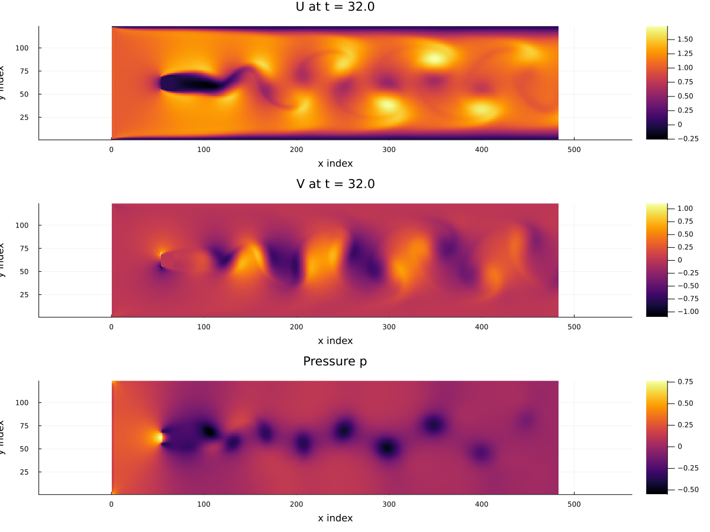

# 2D Channel Flow with a Cylinder

This example solves the two-dimensional incompressible Navier-Stokes equations in a channel using MOLE mimetic operators and a projection (pressure-correction) method.

The cylinder obstacle is introduced as a masked no-slip region inside the channel. To make things easy, the current implementation uses an axis-aligned masked block of cells rather than a fitted curved boundary. The purpose of this example is to show how MOLE operators can be combined to build a transient incompressible flow solver in a direct and compact way.

## Governing Equations

We solve the incompressible Navier-Stokes equations

```math
\begin{equation}
\frac{\partial \mathbf{u}}{\partial t}
+ (\mathbf{u}\cdot\nabla)\mathbf{u}
= -\frac{1}{\rho}\nabla p + \nu \nabla^2 \mathbf{u}
\end{equation}
```

```math
\begin{equation}
\nabla \cdot \mathbf{u} = 0
\end{equation}
```

where $\mathbf{u} = (u,v)$ is the velocity field, $p$ is the pressure, $\rho$ is the density, and $\nu$ is the kinematic viscosity.

## Spatial Domain

The computational domain is

```math
\begin{equation}
x \in [0,8], \qquad y \in [-1,1]
\end{equation}
```

The default grid is $m = 41$ cells in the $x$-direction and $n = 11$ cells in the $y$-direction.

The Reynolds number is defined through

```math
\begin{equation}
\nu = \frac{U_{\mathrm{init}} D_0}{Re}
\end{equation}
```

with the default values $Re = 200$ and $U_{\mathrm{init}} = 1$.

## Initial and Boundary Conditions

### Initial Conditions

At $t = 0$,

```math
\begin{equation}
u = U_{\mathrm{init}}, \qquad v = 0
\end{equation}
```

in the fluid region, and the masked obstacle region is initialized with

```math
\begin{equation}
u = 0, \qquad v = 0
\end{equation}
```

### Velocity Boundary Conditions

- **Inlet (left):** Dirichlet inflow

  ```math
  \begin{equation}
  u = U_{\mathrm{init}}, \qquad v = 0
  \end{equation}
  ```

- **Outlet (right):** zero streamwise gradient

  ```math
  \begin{equation}
  \frac{\partial u}{\partial x} = 0, \qquad \frac{\partial v}{\partial x} = 0
  \end{equation}
  ```

- **Top and bottom walls:** no-slip

  ```math
  \begin{equation}
  u = 0, \qquad v = 0
  \end{equation}
  ```

- **Obstacle mask:** no-slip

  ```math
  \begin{equation}
  u = 0, \qquad v = 0
  \end{equation}
  ```

### Pressure Boundary Conditions

During the pressure Poisson step,

- **Outlet (right):** reference pressure

  ```math
  \begin{equation}
  p = 0
  \end{equation}
  ```

- **All other boundaries:** homogeneous Neumann

  ```math
  \begin{equation}
  \frac{\partial p}{\partial n} = 0
  \end{equation}
  ```

## Numerical Method

A projection method is used to enforce incompressibility.

This is the same overall time-stepping strategy used in both the Octave and C++ implementations.

### Time Integration

The momentum equation is advanced with a mixed time discretization:

- the **convective term** is treated explicitly with **AB2** (Adams-Bashforth 2)
- the **first time step** uses **AB1**
- the **diffusive term** is treated implicitly with **Crank-Nicolson**

The convective term is nonlinear, so an explicit AB2 treatment keeps the method simple and avoids solving a nonlinear system at each time step. The diffusive term is linear and is treated with Crank-Nicolson to obtain a stable and second-order accurate semi-implicit update.

As a result, the intermediate velocity solve uses the matrices

```math
\begin{equation}
M = I - \frac{1}{2}\Delta t \, \nu L,
\qquad
M_p = I + \frac{1}{2}\Delta t \, \nu L
\end{equation}
```

which are the Crank-Nicolson diffusion matrices used in the Helmholtz-type solves for $u^*$ and $v^*$.

### Intermediate Velocity

An intermediate velocity $\mathbf{u}^*$ is computed first from the momentum equation using the explicit convective update and the semi-implicit diffusive update.

### Pressure Poisson Equation

The pressure is then obtained from

```math
\begin{equation}
\nabla^2 p^{n+1}
=
\frac{\rho}{\Delta t}\nabla \cdot \mathbf{u}^*
\end{equation}
```

### Velocity Correction

The velocity is corrected by

```math
\begin{equation}
\mathbf{u}^{n+1}
=
\mathbf{u}^*
-
\frac{\Delta t}{\rho}\nabla p^{n+1}
\end{equation}
```

### Re-application of Velocity Boundary Conditions and Mask

After the pressure correction step, the code re-applies the velocity boundary values and the obstacle mask.

This is done because the projection step updates the full cell-centered velocity field. Re-applying these values ensures that the final updated velocity satisfies the intended inlet, wall, outlet, corner, and masked-region constraints exactly.

## Role of the MOLE Operators

This example is intended to highlight how MOLE operators are used in an incompressible flow solver.

The main operators are

- **Laplacian $L$:** used for viscous diffusion
- **Divergence $D$:** used in the convective flux form and in the pressure Poisson right-hand side
- **Gradient $G$:** used in the pressure correction step
- **Interpolation operators:** used to map between cell-centered values and face-based quantities for flux evaluation and projection

These operators are combined to build

- the Crank-Nicolson diffusion operators
- the pressure Poisson operator
- the interpolation maps needed for face fluxes and pressure-gradient correction


## Running the Example

To run a high-resolution (with `m = 481` and `n = 121`) version of this example, from the `mole/julia/MOLE.jl` directory execute the script with the following command line options:

```
MOLE_CYLINDER_M=481 MOLE_CYLINDER_N=121 MOLE_CYLINDER_DT=0.005 MOLE_CYLINDER_TSPAN=32.0 MOLE_CYLINDER_PLOT=true julia --project=. examples/Navier-Stokes/cylinder_flow_2D.jl
```

## Results

### Julia implementation result


